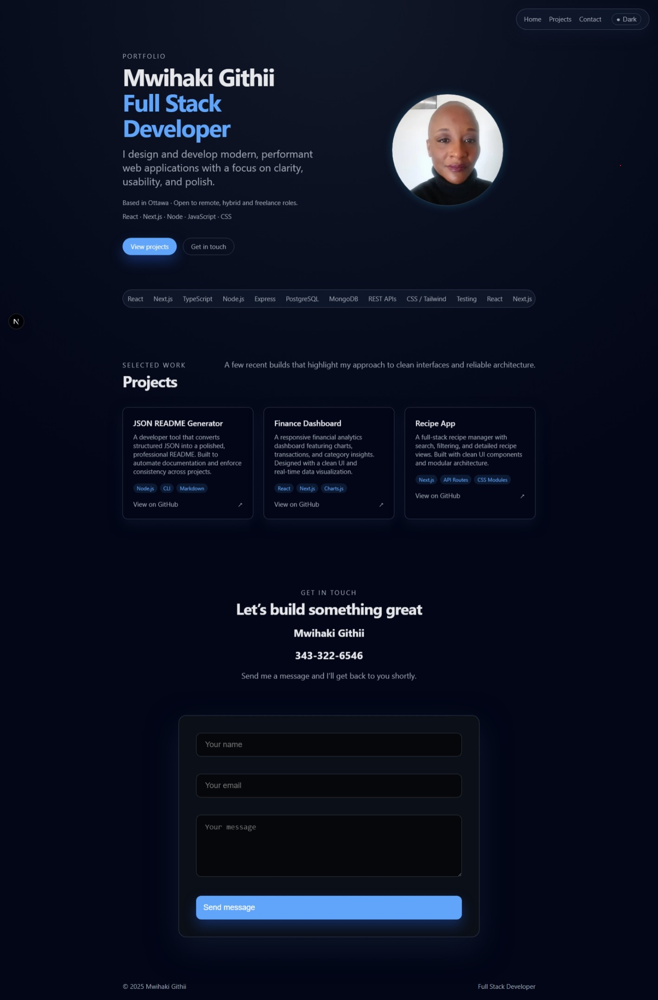

🌐 Developer Portfolio — Mwihaki Githii
A modern, minimal, and performance‑focused developer portfolio built with Next.js, designed to showcase full‑stack capabilities, UI/UX sensibility, and production‑ready engineering practices.

This project demonstrates the same skills and standards I bring to real‑world teams: clarity, structure, accessibility, and thoughtful design.

📸 Screenshots
## 📸 Screenshots

### **Hero + Navigation**

---

### **Projects + Contact Form**

Projects + Contact Form

🚀 Tech Stack
Area	Technologies
Framework	Next.js 14 (App Router)
Language	JavaScript / JSX
Styling	Custom CSS, CSS Variables, Responsive Grid
Images	next/image optimization
Forms	FormSubmit (email delivery)
Deployment	Vercel
🎯 What This Project Demonstrates (Recruiter‑Focused)
1. Strong Front‑End Engineering
Component‑based architecture

Clean, scalable CSS with variables

Responsive grid layouts

Smooth animations and micro‑interactions

Semantic HTML and accessibility best practices

2. UI/UX Design Thinking
Minimal, intentional visual design

Clear hierarchy and spacing

High‑contrast, readable typography

Professional, recruiter‑friendly layout

Consistent design system across sections

3. Full‑Stack Awareness
Form handling without backend complexity

API‑ready structure

Practical use of Next.js  features (routing, image optimization)

4. Professional Communication
Clear project descriptions

Real GitHub project links

A polished contact form that sends messages directly to my inbox

🧩 Key Features
Modern Hero Section
Circular avatar with gradient glow

Subtle floating animation

Crisp, recruiter‑focused introduction

Split layout optimized for readability

Projects Section
Includes three real GitHub projects:

JSON README Generator — developer tooling

Finance Dashboard — UI/UX + data visualization

Recipe App — full‑stack architecture

Each project includes:

Title

Description

Tech stack tags

GitHub link

Contact Section
Wide, premium contact form

Sends messages directly to githiimwihaki@gmail.com

Phone number included for direct outreach

No external email client required

🛠️ Skills Highlighted
Technical
Next.js

React patterns

CSS architecture

Responsive design

Form handling

Image optimization

Soft Skills
Attention to detail

Design intuition

Clear communication

Problem‑solving

Consistency and polish

📦 Project Structure
Code
app/
  ├── components/
  │     ├── Hero.js
  │     ├── ProjectsSection.js
  │     └── ContactSection.js
  ├── globals.css
  ├── layout.js
  └── page.js
public/
  └── images/
screenshots/
  ├── screenshot-hero.png
  └── screenshot-projects.png
🚀 Running Locally
bash
npm install
npm run dev
Visit:
http://localhost:3000

📬 Contact
Mwihaki Githii  
📧 githiimwihaki@gmail.com
📱 343‑322‑6546